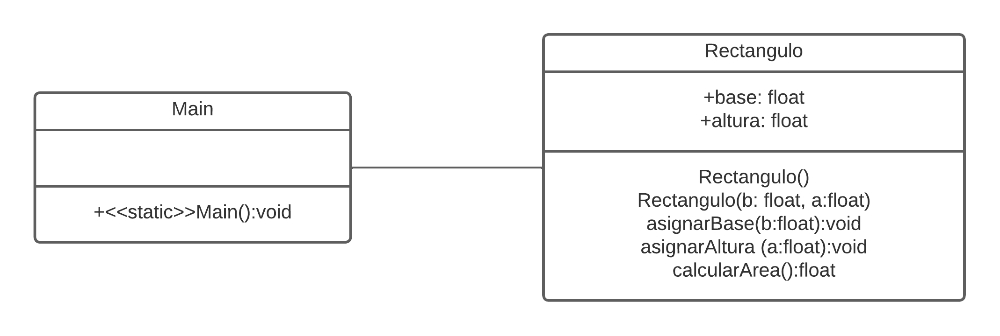

## Actividad 3 - Estructuras Secuenciales
### Área de un rectangulo.

Se requiere conocer el área de un rectángulo. Realice el programa para tal fin.

Se deberá generar las clases `Rectangulo` y `Main`  siguiendo el siguiente diagrama de clases.



Se deberán seguir las siguientes indicaciones:

  * La base y la altura del rectángulo se podrá enviar como parámetros en línea de comandos en la invoación del programa principal. En caso contrario se deberán solicitar al usuario de manera explicita.

Tomando como base lo anterior, se tienen los siguientes ejemplos de salidas esperadas.

**Ejemplo1**

```bash
$java Main 3.2 5.7
18.24
```

**Ejemplo 2**

```bash
$java Main
Digite el valor para la base: 19.2
Digite el valor para la altura: 25.3
485.76
```

**Ejemplo 3**

```bash
$java Main 3.2
!!Advertencia!!
Se tomará el valor 3.2 como la base del Rectángulo
Digite el valor para la altura: 5.9
18.88
```